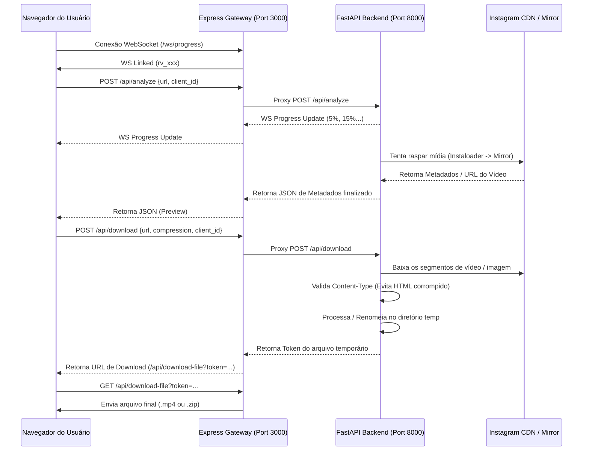

# Documentação Técnica - ReelVault Media Pipeline

Este documento descreve detalhadamente o fluxo de funcionamento do ReelVault, desde a interface do usuário até a entrega final do arquivo de mídia, incluindo o papel de cada classe, método e os pontos de integração entre os servidores Node.js e FastAPI.

---

## 1. Visão Geral da Arquitetura

O ReelVault opera sob uma arquitetura de gateway duplo:
1. **Frontend (React/Vite)**: Interface do usuário reativa que gerencia a entrada de links, exibição de previews de mídia e status de progresso.
2. **Node.js Gateway (`server.ts`)**: Servidor intermediário que serve o frontend, expõe a porta pública (`3000`), gerencia conexões WebSocket nativas para atualização de progresso e atua como proxy para a API interna em Python.
3. **Backend Core (Python/FastAPI - `backend/app`)**: Serviço micro-scraper rodando internamente na porta `8000`. É responsável pela raspagem (scraping) pesada, validações, downloads reais da CDN e empacotamento de arquivos.

### Diagrama de Sequência de Comunicação


---

## 2. Fluxo 1: Análise e Geração de Preview

Quando o usuário insere um link do Instagram no painel e clica em **Analisar**:

### A. Gatilho no Frontend (`src/App.tsx`)
- O método `handleAnalyze(url)` é invocado no frontend.
- O estado `stage` muda para `'analyzing'`.
- O cliente dispara a requisição HTTP POST para `/api/analyze` enviando o `url` e o seu `clientId`.

### B. Gateway Node.js (`server.ts`)
- O Express intercepta a chamada em `app.post("/api/analyze")`.
- Se o backend FastAPI estiver ativo, ele repassa a requisição via `fetch` para `http://127.0.0.1:8000/api/analyze`.

### C. Motor do FastAPI (`backend/app/api/endpoints.py`)
- O endpoint `/api/analyze` recebe a requisição.
- Atualiza o progresso via WebSocket (`manager.send_progress`) para o cliente.
- Invoca a engine de raspagem: `scraper_engine.scrape(url)`.

### D. Pipeline de Raspagem (`backend/app/scrapers/instagram.py`)
O método `scrape(url)` executa a seguinte sequência com fallbacks automáticos:

1. **Extração de Shortcode**:
   - `extract_type_and_shortcode(url)` usa expressões regulares para identificar se a mídia é um `reel`, `post`, `story` ou `tv`, extraindo o identificador único (Ex: `DZS8sy_uj5U`).
   
2. **Método 1: Instaloader (`scrape_with_instaloader`)**:
   - Tenta ler diretamente a mídia pública do Instagram usando a biblioteca `instaloader`.
   - Se obtiver sucesso, extrai o URL da CDN (`post.url` para imagens, `post.video_url` para vídeos), descrição/caption, nome de usuário proprietário e timestamp.
   - **Correção aplicada**: Substituído o atributo antigo e quebrado `post.display_url` por `post.url`.
   
3. **Método 2: Espelhos / Mirrors (`scrape_with_ddinstagram`)**:
   - Se o Instaloader falhar (geralmente por bloqueios 403 ou 401 do Instagram), o fluxo entra no bloco `except` e chama o scraper de espelhos.
   - O espelho prioritário é o `vxinstagram.com` (o antigo `ddinstagram.com` foi relegado por falha de DNS).
   - O scraper faz uma requisição HTTP GET para `https://vxinstagram.com/reel/SHORTCODE/`.
   - O HTML retornado é analisado com a biblioteca `BeautifulSoup`.
   - **Correção aplicada**: Corrigido o bug de sintaxe em BeautifulSoup. Chamadas como `soup.find("meta", name="twitter:player")` lançavam `TypeError` devido a conflitos de argumentos na assinatura do método `find()`. A sintaxe corrigida utiliza `soup.find("meta", attrs={"name": "twitter:player"})`.
   - O Mirror retorna as metatags contendo o URL direto do vídeo redirecionado (`https://vxinstagram.com/offload/SHORTCODE/0.mp4`).

4. **Método 3: Open Graph local (`scrape_with_html_tags`)**:
   - Se os espelhos falharem, o sistema tenta ler diretamente as tags `<meta property="og:video">` fazendo um request HTTP para a página oficial do Instagram com cabeçalhos padrão.

5. **Método 4: Simulação de Emergência (`generate_visually_stunning_mock_media`)**:
   - Caso todos os métodos reais de raspagem falhem (devido a firewalls agressivos), o sistema retorna mídias mockadas royalty-free para manter a interface utilizável e testável.

---

## 3. Fluxo 2: Processamento e Download da Mídia

Assim que os metadados são retornados, o frontend exibe o `PreviewCard` (mostrando o cover do vídeo ou o player com o primeiro frame carregado). O usuário seleciona o perfil de compressão e clica em **Download**.

### A. Gatilho no Frontend
- O componente `PreviewCard` invoca a propriedade `onDownload(compression)`.
- O estado muda para `'downloading'` e o progresso começa a ser transmitido em tempo real.
- O cliente dispara POST para `/api/download` contendo a URL, o clientId e a qualidade (`original` ou `compressed`).

### B. Gateway Node.js e Roteamento FastAPI
- O Express em `server.ts` recebe a rota de download e repassa ao FastAPI em `http://127.0.0.1:8000/api/download` com um timeout estendido de até 2 minutos para processamentos grandes.

### C. Download de Segmentos e Validação (`backend/app/services/downloader.py`)
O método `process_media_download` faz a gestão física dos arquivos:

1. **Instanciação de Nome Único**:
   - Gera caminhos temporários únicos baseados em UUID dentro de `backend/app/temp`.
   
2. **Download Físico**:
   - Para cada item na lista de mídias, faz uma requisição `requests.get` usando múltiplos agentes de usuário (UA) Chrome e Mobile.
   - **Correção aplicada (Evita downloads corrompidos de 30 KB)**: Anteriormente, se a CDN bloqueasse o IP do servidor, ela retornava uma página HTML de erro com status `200 OK` ou `403`. O downloader salvava essa página HTML crua como se fosse o vídeo `.mp4`, resultando em um arquivo quebrado de ~30 KB.
   - Agora, validamos o cabeçalho `Content-Type`:
     ```python
     content_type = response.headers.get("Content-Type", "")
     if "text/html" in content_type:
         # Ignora o corpo HTML de erro e tenta o próximo UA ou fallback
         continue
     ```
   - Se todas as CDNs falharem, o fallback de emergência lê arquivos binários de backup válidos em vez de escrever HTML corrompido.

3. **Compactação**:
   - Se for selecionada a opção `"compressed"`, imagens JPEG são redimensionadas e salvas com qualidade `60%` utilizando a biblioteca PIL (Pillow).
   
4. **Empacotamento ZIP vs Arquivo Único**:
   - **Mais de 1 item (Carrossel)**: Os arquivos temporários individuais são compactados em um arquivo `.zip` e os originais são apagados.
   - **1 item (Reel/Vídeo Único)**: O arquivo é renomeado para o formato final com extensão `.mp4` (para vídeos) ou `.jpg` (para imagens).

### D. Entrega Segura do Arquivo
- O endpoint FastAPI retorna o nome final do arquivo e o token seguro codificado.
- O cliente recebe o link estruturado: `/api/download-file?token=NOME_DO_ARQUIVO.mp4`.
- O navegador faz a requisição GET, o Express valida se o arquivo existe em `temp/` (impedindo ataques de Path Traversal) e envia os bytes usando `res.sendFile(filepath)`.

---

## 4. Resumo das Correções Efetuadas

1. **Atributo `display_url` no Instaloader**: Substituído por `.url`, que é a propriedade de imagem padrão suportada pelas versões modernas da biblioteca.
2. **BeautifulSoup `find()` Parameter Conflict**: Modificadas as chamadas com parâmetro direto `name=` para a forma padrão `attrs={"name": ...}`. Isso resolveu o erro crítico `TypeError: Tag.find() got multiple values for argument 'name'` que desativava o scraper do espelho `vxinstagram.com`.
3. **Priorização de Espelho**: Colocado o mirror `vxinstagram.com` como prioridade na fila de scrapers de mirror, já que o `ddinstagram.com` está inativo no DNS global.
4. **Filtro de Content-Type no Downloader**: Adicionado bloqueio ativo a respostas HTTP com tipo `text/html` no pipeline de escrita de arquivos. Isso assegura que o ReelVault nunca crie arquivos de vídeo vazios/corrompidos.
5. **Correção de Sintaxe de Teste**: Resolvida a chamada órfã de `get_post_url()` no script de teste local `test_download.py`.
